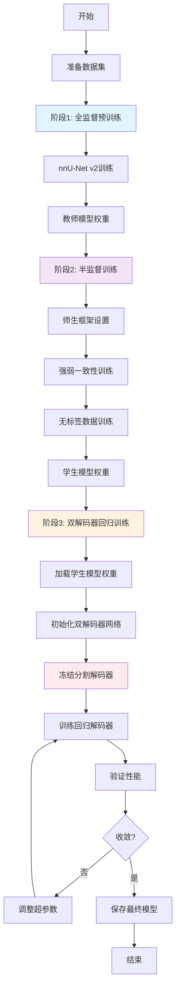
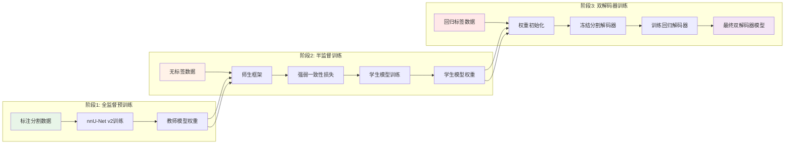
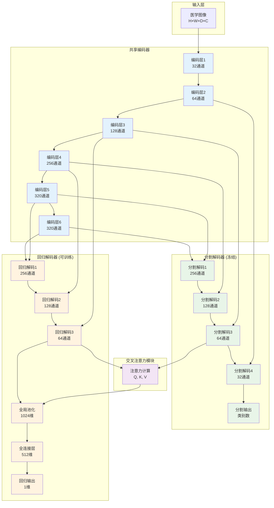
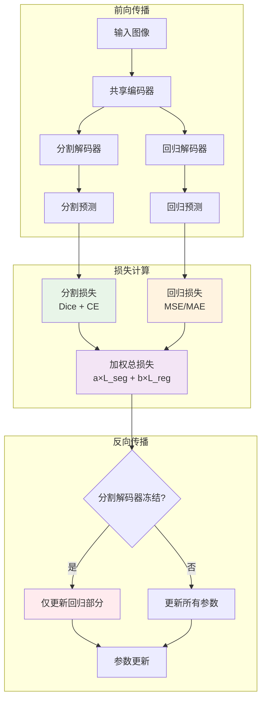
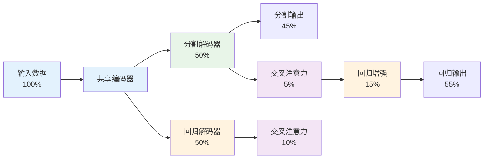
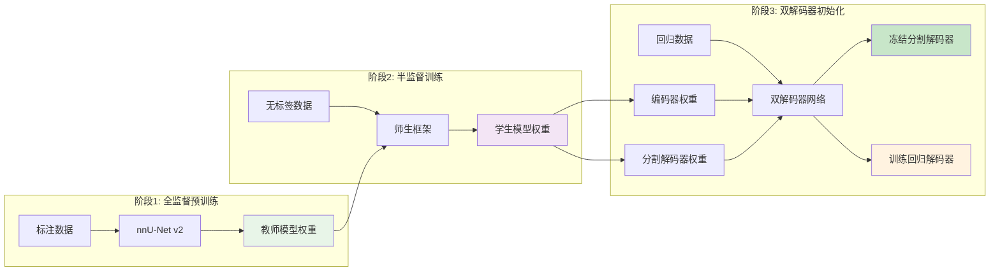
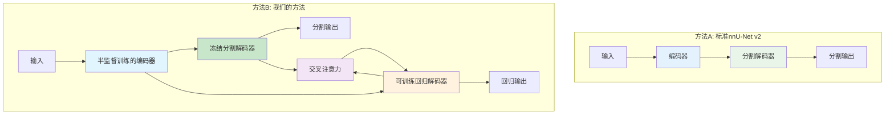
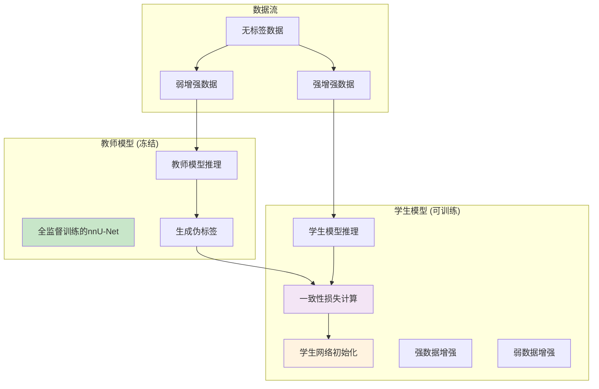
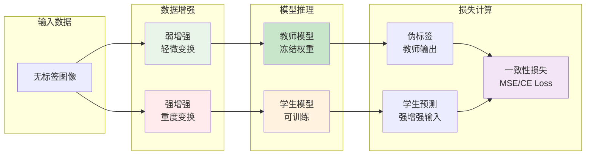
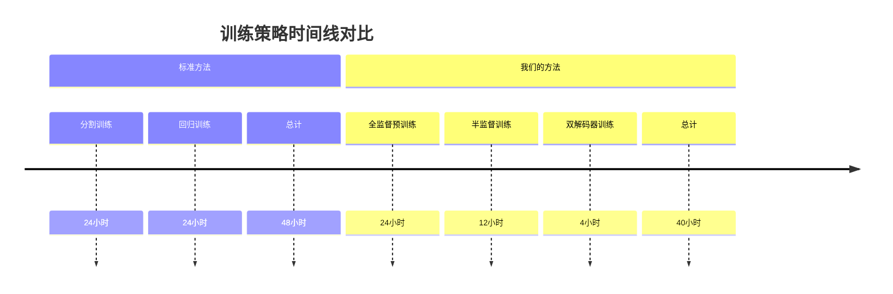

# 双解码器回归网络架构与训练流程图

## 1. 训练流程图

### 1.1 整体训练流程



### 1.2 详细三阶段训练流程



## 2. 双解码器网络结构图

### 2.1 整体网络架构



### 2.2 交叉注意力机制详细结构

```mermaid
graph LR
    subgraph "分割特征"
        SF["分割特征<br/>H×W×D×C"]
    end
    
    subgraph "回归特征"
        RF["回归特征<br/>H×W×D×C"]
    end
    
    subgraph "注意力计算"
        Q[Query<br/>回归特征]
        K[Key<br/>分割特征]
        V[Value<br/>分割特征]
        ATT["注意力权重<br/>Softmax(Q*K_T/sqrt(d))"]
        OUT[增强特征<br/>Attention(Q,K,V)]
    end
    
    subgraph "特征融合"
        ADD["残差连接<br/>RF + a×OUT"]
        FINAL[增强回归特征]
    end
    
    SF --> K
    SF --> V
    RF --> Q
    
    Q --> ATT
    K --> ATT
    ATT --> OUT
    V --> OUT
    
    OUT --> ADD
    RF --> ADD
    ADD --> FINAL
    
    style SF fill:#e8f5e8
    style RF fill:#fff3e0
    style ATT fill:#f3e5f5
    style FINAL fill:#ffebee
```

## 3. 损失函数计算流程



## 4. 数据流向图



## 5. 权重传递流程图



## 6. 模型架构对比



## 6. 半监督师生框架详细流程



### 6.1 强弱一致性损失计算



## 7. 训练策略对比



---

**说明**：
- 蓝色：共享编码器组件
- 绿色：分割相关组件
- 橙色：回归相关组件  
- 紫色：注意力机制
- 红色：关键决策点

这些图表清晰展示了双解码器回归网络的完整架构和训练流程，便于理解和汇报使用。